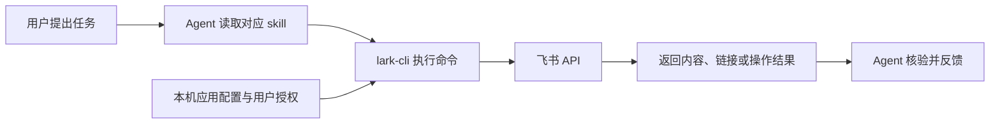

# 飞书能力如何接入

这套接入由官方 CLI、六个官方 skills、飞书应用授权和真实场景验收组成。CLI 提供具体操作，skills 指导 Agent 选择命令并处理分页、身份、文档结构和错误。

## 一次请求如何执行

例如，“读完这个群及每条消息下的回复”会进入 `lark-im`：先定位群，再分页读取主消息，逐个读取话题直到末页，按需下载图片和附件。一个业务 skill 会组合多条 CLI 命令；原子操作由 CLI 实现。

## 六个 skills 分别负责什么

| Skill | 负责的工作 |
| --- | --- |
| `lark-shared` | 身份选择、登录授权、缺失权限、输出与错误处理 |
| `lark-im` | 私聊和群消息、话题回复、消息发送、消息中的图片和文件 |
| `lark-doc` | 读取、新建和编辑文档正文，追加或局部修改内容 |
| `lark-drive` | 云空间资源、元数据、文档权限和附件等文件级操作 |
| `lark-wiki` | 知识库、个人文档库、节点层级及底层文档解析 |
| `lark-calendar` | 日程、忙闲、推荐时间、参与人、改期与取消 |

技能文件放在 `.agents/skills/`，Codex 在本项目中发现它们；`.claude/skills` 通过软链接读取同一份内容。能力边界和命令用法在各 skill 的 `SKILL.md` 与 `references/` 中维护。

## 授权如何生效

当前执行身份是已登录用户，命令显式使用 `--as user`。能否操作某项资源取决于三层条件：

1. 企业自建应用获准使用所需接口权限。
2. 用户完成 OAuth 授权，本机 CLI 的登录凭证实际包含这些权限。
3. 该用户对目标群、文档或日历拥有相应访问权。

管理员审批通过后，可能还需要重新完成用户授权，才能把新增权限授予本机登录。判断依据是实际授权结果与真实调用结果；审批通知和旧授权快照各自只能证明对应时点的状态。

按具体操作缺少的权限增量申请。已授予的权限可能超过某次请求的清单，因此清单不等于凭证的全部权限；重新申请少量权限也不表示旧权限会被撤销。

## 已经验证到什么程度

| 场景 | 已完成的验证 |
| --- | --- |
| 聊天历史 | 主消息分页、逐话题回复、消息详情、合并转发，以及可获取的图片和文件 |
| 代发消息 | 用户指定收件人与内容后，以用户身份发送并读回核对 |
| 文档读写 | 普通文档及知识库文档读取；创建正文、加粗、清单、表格；追加和局部修改后读回 |
| 个人文档库 | 列举节点、读取正文，并查询现有文档的编辑权限 |
| 个人日程 | 读取、忙闲查询、推荐时段、仅本人参加的日程创建、读取会议链接、保持时长改期、取消及清理核验 |

已撤回消息的原文无法恢复。聊天里的外链、会议录音及文档内嵌资源需要各自读取，取得链接或占位信息不等于已读取内容。文档创建成功也不等于已经加入个人文档库。

当前还没有逐项验收独立消息/文档搜索、指定目录或知识库下新建文档、文档图片和附件写入，以及多人邀请、会议室和重复日程。测试日程已取消。

## 仓库保存什么

- 六个官方 skills 及其参考资料。
- [初始读取权限清单](feishu-readonly-scopes.txt)、[已验证的日程权限清单](feishu-calendar-scopes.txt)。
- [环境、授权过程和验收记录](feishu-readonly-setup.md)。
- [上游许可证](../third_party/larksuite-cli-LICENSE)。

CLI 可执行程序、应用配置和授权凭证由运行机器管理。私人消息、文档正文、授权链接和测试过程中的资源标识保留在本机临时材料中。把仓库拉到新机器后，仍需安装 CLI 并配置该机器的登录授权。

当前基线为 `@larksuite/cli@1.0.96`，skills 来自官方仓库 [larksuite/cli](https://github.com/larksuite/cli/tree/cb5a3d704379552dc61e37898e5f74798783190d/skills)，固定提交为 `cb5a3d704379552dc61e37898e5f74798783190d`。本地仅按项目约定将六个 `SKILL.md` 的 frontmatter 保留为 `name` 和 `description`，正文及参考资料沿用上游。
